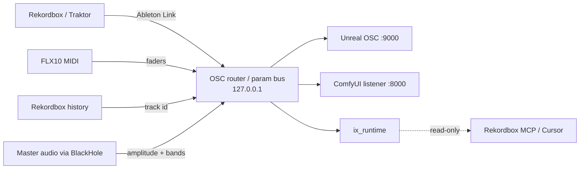

# TODO

Hit these in order. Stop on the first **doable** open item. Detail: `docs/notes.md`. Off-repo tools and library paths stay off git.

**Tracker:** open work is also on [GitHub Issues + milestones](https://github.com/ixamal/ix/milestones?state=all) (ixamal). How this splits from docs: `docs/tracker.md`. Alkalurop mirrors the git docs, not the issue metadata.

Last update: 2026-09-30. **Rock STEMIT done** ([milestone 12](https://github.com/ixamal/ix/milestone/12), [#21](https://github.com/ixamal/ix/issues/21)). Library conversion ≈ **23%** of `MUSIC/GENRES` (3,691 mixes / 15,881). **CRATER** is the daily crate pass. **16ch Channel D + 11a live.** **11b parked.** **13 on hold.** **Next: Floor Phase 1** (local ComfyUI on the MacBook). Existing UE OSC slice still [#9](https://github.com/ixamal/ix/issues/9) (Phase 3). Hardware leftover: **40** ([#10](https://github.com/ixamal/ix/issues/10)). Play history **41** ([#13](https://github.com/ixamal/ix/issues/13)). Reviews **2026-09-16** / **2026-10-09**. Publish: alkalurop mirror with this tip.

## Now

Crate is path-stable. Music.app, Traktor, and Rekordbox are playable from the same files. Sync Library Off. STEMIT + Music folders are in the xml sidecar and imported. Rock genre factory batch is off the open list.

**Next:** **Floor Phase 1** — local ComfyUI on the MacBook (Apple Silicon, PyTorch MPS, force-fp16, distilled 1–4 step models at 512×512, OSC listener on `127.0.0.1:8000`). Then Phase 2 texture passing (Syphon/NDI → UE dynamic material), then Phase 3 stage reactivity (Niagara + lighting on the same OSC). RedefineFX Chaos & Niagara Destruction stays the performant-effects learning track (Phase 3). TouchDesigner later, not Phase 1. Do not start Blender/Maya before the ComfyUI slice. 11 + 11a proven. **11b parked** (FLX10 aggregate silenced the Sony until a reboot, 2026-09-23 correction). **13 on hold** (S8 pads → S88). Hardware leftover: **40**. If 16ch fails, **Aggregate Device Maschine** + `~/Music/blackhole_2ch/`. Crate leftover: reload Rekordbox xml (`<>`) / analyze DJ Sets, or STEMIT Alternative **1–3** (TODO 17) when David names it. Daily playlists: **CRATER** (`ix_crate crater`). Never write Apple Music from the factory. Never stem **Acapella**. Do not farm 35k to the cloud. Do not Discogs-blast.

## Crate (done)

- [x] 1. ATGR in (ReCK, DJCU2, Mixed in Key). Traktor collection migrated into Rekordbox.
- [x] 1a. Unknown Album, mashups, Inbox emptied. Leftovers: `Compilations/Mashups/Miscellaneous/`.
- [x] 1b. `stems_audio/Unknown Artist/` gone. 6 stale NML rows rematched. 5 ScreenRecording WAVs gone.
- [x] 1c. Traktor `collection.nml` remapped (27,564 live / 1,302 unmatched). Playlist keys repaired (100).
- [x] 2. DJCU2 Traktor → Rekordbox (2026-08-30). Process: `docs/djcu2.md`. Site: [atgr.nl](https://atgr.nl/).
- [x] 3. Path-stable. 4,908 shared live owned files; Traktor and Rekordbox same path on 4,901.
- [x] 16. **Music.app same-file rows.** 625 files had two Songs entries on the same path (Show in Finder → same file). Dropped 625 extra library rows. Files stayed (23,632 → 23,007 file tracks). `PYTHONPATH=crate python3 -m ix_crate music-dupes`. Aqua HUD via stems `py.utils.progress`.
- [x] 18. **Music.app Locate / ! rows.** Relinked 375 unique disk matches (`music-repair`). 16 Bit Lolitas from the screenshot included. 260 unmatched (duplicate copies, truncated mix-CD names, or no file). Identity/genre fill only on gaps (crate cascade + iTunes genre). Did not move Media.localized. Did not Discogs.
- [x] 19. **Music.app playlist Fix.** 685 file tracks. Tagged **188** (filename 125, iTunes+Deezer 58, Ollama 5). **497** left unidentified (`Track 01`, Cream Live, mix-CD names with no unique catalog match). Dump albums → `Singles` when artist known. Cream Live kept. WAV mutagen abort replayed. `PYTHONPATH=crate python3 -m ix_crate music-fix --playlist Fix --execute`. No Discogs. Did not move Media.localized.
- [x] 20. **Fix leftovers — heavy pass.** 497 remaining gaps tagged. iTunes 126, Deezer 20, MusicBrainz 21, dual catalog 3, Various Artists salvage 327. Playlist Fix now has **0** empty artists. AcoustID ran on every gap (mix-CD rips mostly unlinked in the fingerprint DB). Cream Live kept. No Discogs. Did not move Media.localized.
- [x] 21. **Various Artists cleanup.** AcoustID + Shazam (`shazamio` in `~/local_tools/crate/shazam-venv`, Python 3.12). No Beets import. 263 tagged (237 Shazam, 18 MusicBrainz, 6 iTunes/Deezer, 2 tags). 75 unidentified left as VA. Hits write artist, album artist, clear compilation. `music-fix --library-va --execute`. Report `~/local_tools/crate/reports/music-fix-20260903T040145Z.json`.
- [x] 22. **Screenshot compilations (one album at a time).** David sends a Music.app shot; agent looks up **that** Discogs/iTunes release only (not a library blast). Write per-track artists, DJ/compiler as album artist, compilation **off**, genre House unless the shot says otherwise. Strip `01 Title` prefixes. Unify duplicate album-name variants; drop extra Music.app **rows** only. Keep the file-backed row (or re-add the rip if the keeper was a `!`). How/why: `docs/crate.md` (Screenshot compilations). Done this night: mix-CD numbered **artist** prefixes (keep 16 Bit Lolitas / 28 East Boyz / 51 Days / 68 Beats / 95 North); Mix This Pussy; GU **010 Athens** discs 1–2 (album artist Danny Tenaglia); Mushroom Jazz 7 order + two duration mislabels; Lazy Dog + Volume 2 (Ben Watt & Jay Hannan, 53 extra rows dropped, 3 `!` relinked). Music.app may need a quit/reopen after a big write; Shuffle is independent of tag order.

- [x] 23. **STEMIT + Music.app copy-on-add.** Drag-and-drop into Music.app failed with *“Attempting to copy to the disk ‘Data’ failed. A duplicate file name was specified.”* Cause: `Media.localized/Music` was a leftover iTunes **symlink to `.`**, so every copy landed on an existing path. Replaced with a real folder; Beatport + Traxsource drag-and-drop confirmed. New copies live at `Media.localized/Music/Artist/Album/`; the old crate stays at `Media.localized/Artist/`. `music-repair` now skips `Music/` as an artist name. Then built **STEMIT** (`ix_crate stemit`): Music.app playlist → hardlink mix into `stems_audio` → stems `py.exec.separate`. First run **Never Forget 50th v01**: 21/21 tracks, 42/42 factory writes, 0 fail, 1.50 GB, 78 min (3.7 min/track). Lords Of Acid *Undress and Possess* correctly dropped its pair (`we found none` — the mix **is** the instrumental) and still got `.stem.m4a`. All 21 mixes are still hardlinks to Apple Music (no copies, no moves).
- [x] 24. **EDM recurrence + replicants.** Consolidation brought `EDM, …` back (229 rows) and copied already-held tracks in again because iTunes names a second copy `Track 1.m4a`. Terrarum recover brought 66 more. `music-genre` promotes the prefix on files + library (two-layer; leftover `EDM*`: 0). Never mutagen-write `.wav`. `music-replicants` drops extra rows whose files decode to the same audio (476). `music-dupes` dropped 146 same-file extras. `consolidate` now strips the iTunes duplicate marker from title keys. How/why: `docs/crate.md`. README toolkit.
- [x] 25. **Cull remaining `!` / invalid media.** Terrarum search closed. `music-cull` dropped **425** Music.app rows (424 empty location, 1 `.itlp`). **0** corrupt WAV/AIFF. Library **21,824** file tracks, leftover drop **0**. Valid files stayed. How/why: `docs/crate.md`.
- [x] 26. **Disk names from Music.app metadata.** `music-organize` files `Media.localized` as Artist / Album / `NN Title` from the Songs row. Playlist Fix is gone. Compilations stay unless album artist is the DJ; split compilations stay together. `Media.localized/Music/` folder moves are locked (Music.app restores them). `--placeholders-only` executed **17** `Track 01` renames. Second pass: **606** artist-root tracks now under `Music/Artist/Album`; **472** Music-tree files stayed. How/why: `docs/crate.md`.
- [x] 27. **STEMIT crate playlists.** `--sync-playlists` walks `stems_audio` in any state and writes Traktor + Rekordbox **Mixes / Stems / Acapellas / Instrumentals**. 2026-09-06 execute: 8,785 on disk; Traktor +3,904 rows; Rekordbox XML +7,823 rows. Never push acapellas back to Apple Music. Analyze stays in-app.
- [ ] 28. **Role titles (`vocals`).** [#7](https://github.com/ixamal/ix/issues/7). Disk tags written 2026-09-07. NML patched **4,709** titles (Traktor quit). Reopen Traktor, confirm All Tracks, then **DJCU2** to Rekordbox. Do not rewrite rekordbox.xml. OneTagger Beatport is dead; do not Discogs-blast.
- [x] 29. **Traktor playlist dupes + artwork.** 2026-09-07: dropped **237** duplicate PRIMARYKEY rows (Humid chills 86, stems_audio 94, 2024 Alive 29, …). Copied **3,512** sibling COVERARTIDs (8 broken pointers replaced). Backup `collection.nml.pre-nml-repair-20260907T133704Z`. Mix/stem/vocals are not copies. Reopen Traktor. Then DJCU2.
- [x] 30. **STEMIT copy-twins.** Mixes was listing `.stem (2).m4a` and `vocals (2).wav` next to the real files. Dropped **186** Finder copies after mutagen length + decoded-audio match (WAV/mp3). STEMIT crates rebuilt from disk; numbered `(2)` files are not listed. 889 stem `(2)` files kept on disk (size/head differ — not the same bytes). Reopen Traktor. Then DJCU2.
- [x] 30a. **STEMIT looked empty.** ElementTree `clear()` stripped `TYPE="LIST"` / `UUID`; rewrite also left empty name-only playlist shells first. Traktor shows the first node. Fixed 2026-09-07: four crates Mixes 1403 / Stems 1896 / Acapellas 2032 / Instrumentals 1749, each `TYPE=LIST`. Reopen Traktor.
- [x] 31. **Industry Stems artists + STEMIT crate keepers.** 2026-09-08: **202/209** packs crate-matched (7 remix leftovers still IndustryStems). Patched **808** NML ARTIST rows. Never WAV tags. STEMIT crates rebuilt: one row per identity, **383** extra playlist rows dropped (Stems 125 groups). Files stayed on disk. Specimens: `docs/examples/stemit-industry-artists.py`, `docs/examples/music-set-industry-artist.applescript`. Reopen Traktor. Then DJCU2.
- [x] 32. **STEMIT disk dedupe.** 2026-09-08: **286** copies deleted (197 + 89), **43** empty folders pruned. Unique mashups stayed. Industry Stems WAV packs stayed. Live vs studio (FLA Gun) kept. Google Drive shortcut skipped. STEMIT rebuilt. Reopen Traktor. Then DJCU2.
- [x] 34. **Finder `(2)` copies.** 2026-09-08: deleted **920** disk copies (same title+artist role as the keeper) and dropped missing stems_audio NML rows. Mix/stem/vocals/instrumental stayed four files. Live vs studio stayed. Reopen Traktor. Then DJCU2.
- [x] 35. **STEMIT genre crates.** 2026-09-08: NML `STEMIT/Genres` **53** folders. `stemit --genres --execute` promotes the same tree into `rekordbox.xml` (NML stays). DJCU2 is not the folder bridge.
- [x] 36. **Never Forget playlist refill.** 2026-09-08: `music-playlist` matched **21/21** Downloads filenames to `Media.localized` Songs rows and refilled **Never Forget 50th v01**. Use this after a reorg empties a Music.app playlist. Do not copy Downloads in again.
- [x] 37. **Playlist membership bridge.** `crates --from music|nml|xml --to music|nml|xml`. Music → `rekordbox.xml/MUSIC/`, NML → `rekordbox.xml/TRAKTOR/`. Path + hardlink match. Collection cues / energy / comments stay. Unmatched tracks skipped, not stubbed. STEMIT stays `stemit --genres`. DJCU2 for cues on tracks Rekordbox does not have. How/why: `docs/crate.md`.
- [x] 38. **Crate night (2026-09-08).** `music-genre --xml --execute`: **10,457** TRACK Genre rows (`EDM, …` leftover **0**). `crates --from music --to xml --all --execute`: **107** Music.app playlists under `MUSIC/` — **House** 14, **Origin Stories** 90, root DJ Sets / Front to Back / Never Forget 50th v01. **5,131** keys matched; **5,961** Music-only files skipped (not stubbed). Rekordbox imported MUSIC into collection. David playing in Rekordbox + Traktor. Import log skipped **21** files: **16** stale/missing paths, **4** Apple `.m4p` DRM. `<>` reload; Don't ask again + No on tag overwrite.
- [x] 39. **Empty MUSIC crates + IndustryStems listen (2026-09-10).** `crates` now ingests missing files that exist on disk (Location row, not a 0.00 BPM stub). Skip `.m4p`. Music → NML + xml `--all --execute`: **111** playlists. **DJ Sets 0 → 230** (236 in Music; 6 DRM skipped). MUSIC empties **28 → 5** (empty or DRM-only in Music). `stemit --fix-industry-artists`: **209/209** packs (crate 201 + prefix 4 + MusicBrainz 2 + Shazam 2). NML IndustryStems artist **0**. xml artist **968 → 0** (831 live + 133 dead-path ghosts by pack folder). Music.app already **0**. Played / NPBS now under MUSIC/ on both decks. Analyze new DJ Sets rows in-app. How/why: `docs/notes.md`.
- [x] 39a. **IndustryStems folder kept (2026-09-19).** `~/Music/stems_audio/IndustryStems/` is the official 4-WAV crate (**209** packs, **835** wav, **44 GB**). Artists named (31 / 39). Not factory-stemmed, not moved, not hardlinked elsewhere. Live: Traktor 4.5.1 **1251** path hits, rekordbox.xml **968** Location rows. Looks like a leftover dump; it is organized and playable. **Do not delete.**

## Tagging

- [x] 4. `EDM, …` prefix + Accapella. 11,031 files + 11,731 Music.app rows. Leftover `EDM*`: 0. 14 `Acapella`. Incomplete for comma leftovers — see **8** and **9**. `docs/onetagger.md`.
- [x] 4a. Music.app does not re-read file tags. Same two-layer write applies to 8 and 9. Specimen (do not run): `docs/examples/music-set-genre.applescript`.
- [x] 5. **Omitted (not viable).** Beatport via OneTagger 1.7.0. [PR #526](https://github.com/Marekkon5/onetagger/pull/526) unmerged. Links: `docs/notes.md`.
- [x] 5b. **Omitted (not viable).** Embed-while-processing needed the same stores as 5. STEM rule if reopened: never mutagen-write `.stem.m4a`.
- [x] 6. **Omitted.** Ollama was reviewer-after-stores. Not a catalog.
- [x] 7. Beets is not the library of record.
- [x] 8. **`House, …` comma compounds.** 1,135 owned files + 1,301 Music.app rows. `House, Deep` → Deep House (699), Tech → Tech House (268), Progressive → Progressive House (136), plus Funk/Soul/Disco, Minimal/Deep Tech, Melodic, Indie/Nu Disco, Electro, Latin, Garage, STEMS, doubled labels. Music.app leftover `House,`: **0**. Disk leftover: **0**.
- [x] 9. **Merge Hip Hop spellings.** `Hip-Hop` → `Hip Hop` on files. Music.app: one leftover — Freddie Joachim *Rain Drops* (file permission / likely stream). Left `Hip Hop / House` (1). Did not fold `Hip-Hop/Rap` or `Hip Hop / R&B`.

## Stems (STEMIT)

**STEMIT** = Music.app playlist → hardlink mix into `~/Music/stems_audio` → [ixamal/stems](https://github.com/ixamal/stems) `py.exec.separate` (HUD: `py.utils.progress`). Skip if that Artist/Album/Title already has a `.stem.m4a`. ~3.8 min/track on this Mac. `PYTHONPATH=crate python3 -m ix_crate stemit --playlist "…"`. Genre batch (library order, exact Music.app genre): `--genre Rock --limit 100`. Aqua HUD (`py.utils.progress`) shows elapsed + ETA. How/why: `docs/crate.md`.

- [x] 14. **Acapella — do not stem.** Sources already *are* the vocal. Let It Go and I Get Deep already have `.stem.m4a`. Music.app extras have no local file.
- [x] 15. **Afro House.** Dialed In already had stem + pair. Local factory wrote Roots, Koma Kobache, Iris (hardlink mix in `stems_audio`, then Mel pair + `.stem.m4a`). Never wrote Media.localized.
- [x] 16b. **STEMIT proved.** `Never Forget 50th v01`, 21 tracks: 21 `.stem.m4a`, 20 full Rekordbox pairs, 1 correct pair drop, 0 fail. 78 min. Detail in item 23.
- [x] 16c. **Rock genre STEMIT.** 2026-09-24: Music.app Rock batch complete (paged factory + catch-up; existing `.stem.m4a` skipped). FairPlay `drms` → `apple drm`. Off open work ([milestone 12](https://github.com/ixamal/ix/milestone/12), [#21](https://github.com/ixamal/ix/issues/21); stems [#1](https://github.com/ixamal/stems/issues/1) closed). **≈ 23%** of `MUSIC/GENRES` converted (3,691 mixes / 15,881). Publish via alkalurop bridge.
- [ ] 17. **Alternative, tracks 1–3 only.** [#8](https://github.com/ixamal/ix/issues/8). Same STEMIT path, genre batch instead of a playlist. Skip existing `stems_audio` Artist/Album/Title. Never stem Acapella.

## Floor / Elysium — generative visual pipeline (next)

Notes only — priorities for work on the Ix machine. Do not install software, enroll in courses, or implement from this list. Drive with **Grok/Gemini** via Cursor / Grok Bot; Claude CLI is optional and **not required** for DCC MCP.

Licenses available: Unreal Engine, Maya, Blender.

**Pipeline (in order):** DJ software or DAW (Ableton, Traktor, Rekordbox) sends OSC/MIDI on the local network into a ComfyUI node pipeline (Apple MPS, TensorRT, LCM, SDXL Turbo). ComfyUI streams live video via Syphon/NDI into Unreal Engine 5 or TouchDesigner (lighting and Niagara). That is the stage output.

**Target:** macOS Apple Silicon. PyTorch MPS, force-fp16. High frame rate at low latent resolution (~512×512), then scale in the 3D engine. Memory has to stay low enough to run beside a DAW.

This replaces the old Unreal-MCP-first → Maya → Blender → Houdini order. Existing 10 / 10a–c Niagara slice still matters; it sits in Phase 3. RedefineFX Chaos & Niagara Destruction is the learning-session track for performant Chaos + Niagara effects (Phase 3).

### Live feed — Rekordbox / Traktor → param bus → UE + ComfyUI

The OSC router (10f) owns the inputs and fans them out on loopback. The Rekordbox MCP (`dj-rekordbox`) is **not** in the live path: it only reads `ix_runtime` so Cursor can see the feed. No LLM in the beat loop.

- Pro DJ Link does not apply: it is for CDJ networks, not Rekordbox Performance mode on the USB FLX10.
- Rekordbox cannot give ComfyUI amplitude / frequency bands (46b). Those come from the master audio on BlackHole.
- Port clash today: `ix_runtime` and the UE OSC plugin both want UDP `127.0.0.1:9000`. The router fixes it: UE keeps 9000, ComfyUI 8000, `ix_runtime` moves to its own port as the observer.

Build order (notes only — do not install from this list):

- [ ] 50. **Ableton Link → OSC** for `/rekordbox/bpm` and `/rekordbox/beat_phase`. Rekordbox (6+) and Traktor both join Link, so one bridge covers either deck software. First piece of 10f.
- [ ] 50a. **FLX10 MIDI → OSC** for `/rekordbox/fader`. CoreMIDI lets a listener read the FLX10 alongside Rekordbox.
- [ ] 50b. **BlackHole master audio → amplitude + frequency bands** for ComfyUI (46b).
- [ ] 50c. **Rekordbox history → `/rekordbox/track_id`** (pyrekordbox). Seconds behind: fine for look switches, not for beat timing.

### Phase 1 — local ComfyUI on the MacBook

Native Apple Silicon. Python 3.11. PyTorch MPS, force-fp16. Distilled models (SDXL Turbo, LCM, Flux.1 schnell), 1–4 steps, 512×512. Lightweight OSC listener on UDP `127.0.0.1:8000` for amplitude and frequency bands, threaded so it never locks generation. Route those floats into prompt weights, denoise, or latent seed.

- [x] 46. **ComfyUI native on Apple Silicon.** Installed 2026-09-30 (David asked): ComfyUI 0.38.0, Python 3.13 (upstream now recommends 3.13 over 3.11), PyTorch 2.14 MPS, force-fp16, Manager on. `127.0.0.1:8188` only. Setup: `docs/local-setup.md` → ComfyUI.
- [ ] 46a. **Distilled models.** SDXL Turbo, LCM, Flux.1 schnell. 1–4 steps at 512×512. High frame rate at the latent; scale later in the 3D engine. **SDXL Turbo in and proven:** 1 step 512×512 ≈ **0.25 s/frame (~4 fps) warm** on the M5 Max. Still to add: FLUX.1 schnell (Apache 2.0, license-clean default for paid gigs). SDXL Turbo needs Stability Community License registration before commercial use.
- [ ] 46b. **OSC listener node.** UDP `127.0.0.1:8000`. Amplitude and frequency bands. Threaded; must not lock generation.
- [ ] 46c. **Route OSC floats** into prompt weights, denoise, or latent seed.
- [ ] 10h. **Rekordbox + Traktor → OSC/MIDI** into the same param bus that feeds ComfyUI (and, in Phase 3, Unreal). Live path. **No LLM** in the beat loop — ComfyUI diffusion is not the Ollama oracle.
- [ ] 10f. OSC **Router** + shared **param bus** (DJ live path into ComfyUI and, later, UE lighting / Niagara).
- [ ] 10g. Smoke test driven by Grok/Gemini (not Claude-required).

### Phase 2 — texture passing ComfyUI → Unreal

Syphon or NDI exporter that sends tensors from memory, no disk. UE5 receiver bound to a dynamic material.

- [ ] 47. **Syphon/NDI exporter** from ComfyUI. Tensors from memory; no disk.
- [ ] 47a. **UE5 receiver** bound to a dynamic material.
- [ ] 10d. **Unreal MCP** (global `~/.cursor/mcp.json`, adapters off-repo). Same Unreal project as the material receiver.

### Phase 3 — stage reactivity

Map the live material onto panels, projection meshes, or stage geometry. Niagara and lighting driven by the same OSC channels.

- [ ] 48. Map the live material onto panels, projection meshes, or stage geometry.
- [ ] 10. Rekordbox/Traktor OSC on `127.0.0.1:9000` (`/rekordbox/bpm`, `/fader`, `/beat_phase`) into UE. No ID3, no library convert. Parent issue: [#9](https://github.com/ixamal/ix/issues/9).
- [ ] 10a. Enable UE OSC plugin. Listen `127.0.0.1:9000`.
- [ ] 10b. Niagara Grid 3D Gas/Smoke. Record 15s sim cache.
- [ ] 10c. Bind `/rekordbox/bpm` and `/rekordbox/fader` to cache Explicit Time / density.
- [ ] 10e. **PCG** in the same Unreal project as the OSC / Niagara / live-material work.
- [ ] 10i. **RedefineFX Chaos & Niagara Destruction** ([redefinefx.com](https://redefinefx.com) / [Chaos & Niagara Destruction](https://redefinefx.com/chaos/)). Learning sessions for Unreal performant effects (Chaos destruction + Niagara). Sits with Phase 3 Niagara work (10 / 10a–c); not a substitute for the live OSC → material / lighting slice. Notes only — do not enroll or install from this list.

### Later — TouchDesigner

TouchDesigner is a later integration, not a competitor and not Phase 1. Alkalurops as an AI engine that plugs into TD via Syphon/Spout or a custom node.

- [ ] 49. TouchDesigner via Syphon/Spout or a custom node. After Phase 1–3. Not v1 of the MacBook booth slice.

### Later — DCC content (not live in the beat loop)

- [ ] 42. **Maya.** Modeling / character animation → cached or static content for Unreal. Not live in the beat loop.
- [ ] 43. **Blender.** Same content role as Maya (cached/static for UE). User knows Maya/Blender best; still do not start Blender before the ComfyUI → UE slice.
- [ ] 44. **Houdini last to wire** (desired future, not v1). Procedural + MCP + HDA-in-UE. No Houdini required for the first slice.
- [ ] 45. Shared **dcc-mcp gateway** as the multi-DCC backbone when more than one DCC is needed. Not a substitute for Phases 1–3.

### Explicit non-goals for now

- Do not install software, enroll in courses, or implement ComfyUI / Syphon / UE nodes from this list.
- Do not put an LLM (Ollama) in the live DJ beat loop. ComfyUI diffusion is the generative path; the oracle stays off the beat.
- TouchDesigner is not Phase 1 and is not a competitor.
- Do not start Blender / Maya / Houdini before the ComfyUI → Unreal slice.
- Do not assume Claude is required for Houdini / Maya / Blender MCP.
- Do not enroll in RedefineFX or install course materials from this list.
- Do not put patent strategy, pricing, or conference travel budgets in this list.

## NI / Maschine (13 on hold)

Parked in [ixamal/blackhole](https://github.com/ixamal/blackhole). Session opened **2026-09-19**. 2ch archived at `~/Music/blackhole_2ch/`.

- [x] 11. Port BlackHole **2ch Channel D** onto **16ch**. 2026-09-19: Traktor **Traktor S8 + BlackHole**, D = **11/12** (`In 10`/`In 11`), A/B/C + FX Send disconnected. Maschine **BlackHole 16ch** Out 1 = 0/1, Out 2+ disconnected. Tone + sound check. First flip had D on In 11/12 (right-only); corrected. Rollback: `~/Music/blackhole_2ch/`.
- [x] 11a. **Sample Traktor A / B / C into Maschine.** 2026-09-19: Internal Record **7/8** (`Out 6`/`Out 7`) → Maschine In 2 → S88 → D. A, B, and C all check. KK out. Link is clock. Did not flip External. Never Record **5/6**.
- [ ] 12. Convert NI/Traktor material to WAV or AIFF only if file samples are needed. `~/local_tools`.
- [ ] 13. **On hold.** [#11](https://github.com/ixamal/ix/issues/11). S8 pads → S88 sample slots. After Floor.

## FLX10 / Traktor feed

- [ ] 11b. **FLX10 → Maschine In 3.** [#12](https://github.com/ixamal/ix/issues/12). Parked 2026-09-19. Aggregate silenced the Sony, booth, and master; David (2026-09-23): that needed a reboot, not a ban. Scripts stay; box was destroyed. Not **40**.
- [ ] 40. **Traktor mix → FLX10 CH2.** [#10](https://github.com/ixamal/ix/issues/10). 2026-09-23 afternoon: LINE cannot take BlackHole the way S8 Channel D does. LINE is the rear RCA. A/B play a DJ-software deck; Rekordbox has no Live Input. CoreAudio outs are master and phones (skip the fader; can hit the Sony). Working feed stays the S8 RCA on **LINE**. Room hub: Sony STR-AN1000, AudioQuest + sub controller → SVS, KRK Rokit 5 booth. Serials later. iFi iDefender Max stays (Bloom Audio 52738, 2026-05-08). Detail: `docs/notes.md`.

## Play history (parked)

- [ ] 41. **Played / Not Played But Should.** [#13](https://github.com/ixamal/ix/issues/13). Daily uber is **CRATER** (`ix_crate crater`): favorites + `MUSIC/GENRES` + `MUSIC/ACAPELLAS` + STEMIT four crates + `STEMIT/Genres`, then Music → DJ when Music is open. Never the stem factory. `favorites` harvests plays + genre/BPM/energy/vibe (MiK `Energy N` comments). Live JSON gitignored; `favorites --snapshot` is the quarterly git copy (`configs/quarterly/*-2026Q3.json` is the first draft). `Played` = 100 most recent. Daily `Not Played But Should` / Neglected genres / Random / Favorites (12 each); library acapella titles stay out of those picks; skip crates if the play fingerprint is unchanged. No Untagged playlist; leftovers use `follow_unmatched()` (MusicBrainz, then Shazam). Local LLM reads `play-patterns.json` on `127.0.0.1`. Own-repo the model quarterly if it outgrows crate. Reviews: **2026-09-16**, **2026-10-09**. Nightly 5am: `docs/examples/crater-nightly.sh` (not loaded). Process: `docs/crate.md`.
